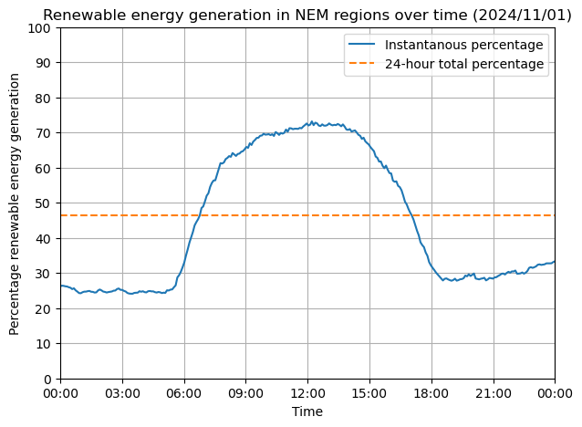
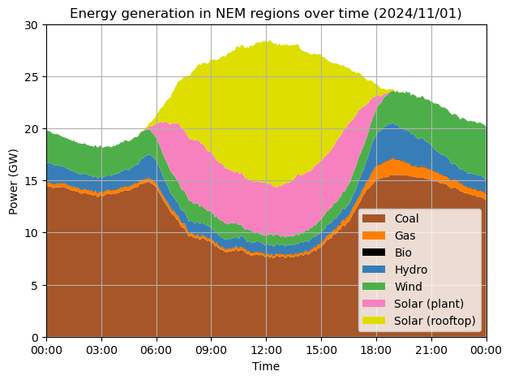
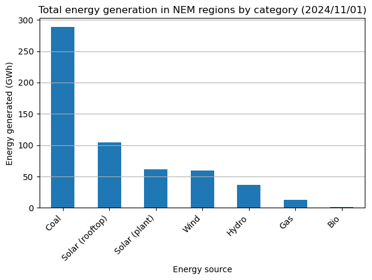
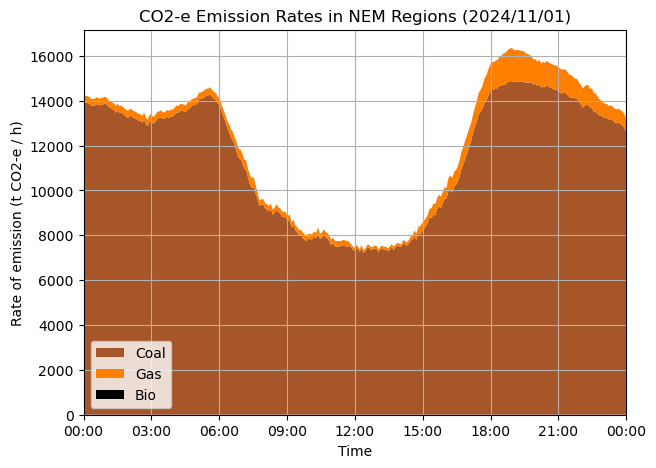

In this Jupyter notebook, we take a brief look at energy data provided by the Australian Energy Market Operator (AEMO) over a 24-hour period on 2024/11/01. We focus on the spread of fuel sources in regions participating in the National Energy Market (NEM), the prevalence of renewables, and the greenhouse gas emissions over this period, producing the following plots:

| | | 
|:-------------------------:|:-------------------------:|
| |  |
|  |  |

We find the total percentage of energy generated by renewables over the 24-hour period is 46.4%. Renewable energy generation reaches a peak of 72.5% during daylight hours when solar generation is at its peak, and attains a minimum of 22.5% before sunrise. The total carbon emissions over the 24-hour period are approximately 298,000 t CO2-e, with a minimum emissions rate during daylight hours of 7,350 t CO2-e / h, and a maximum emissions rate of 16,351 t CO2-e / h early in the evening.